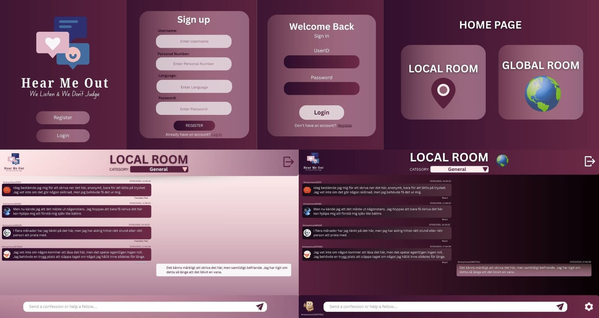

# Backend and Frontend Template

Latest version: https://git.chalmers.se/courses/dit342/group-00-web

This template refers to itself as `group-00-web`. In your project, use your group number in place of `00`.

## Project Structure

| File                                                 | Purpose                     | What you do?                             |
| ---------------------------------------------------- | --------------------------- | ---------------------------------------- |
| `server/`                                            | Backend server code         | All your server code                     |
| [server/README.md](server/README.md)                 | Everything about the server | **READ ME** carefully!                   |
| `client/`                                            | Frontend client code        | All your client code                     |
| [client/README.md](client/README.md)                 | Everything about the client | **READ ME** carefully!                   |
| [docs/LOCAL_DEPLOYMENT.md](docs/LOCAL_DEPLOYMENT.md) | Local production deployment | Deploy your app local in production mode |

## Requirements

The version numbers in brackets indicate the tested versions but feel free to use more recent versions.
You can also use alternative tools if you know how to configure them (e.g., Firefox instead of Chrome).

- [Git](https://git-scm.com/) (v2) => [installation instructions](https://www.atlassian.com/git/tutorials/install-git)
  - [Add your Git username and set your email](https://docs.github.com/en/get-started/git-basics/setting-your-username-in-git)
    - `git config --global user.name "YOUR_USERNAME"` => check `git config --global user.name`
    - `git config --global user.email "email@example.com"` => check `git config --global user.email`
  - > **Windows users**: We recommend to use the [Git Bash](https://www.atlassian.com/git/tutorials/git-bash) shell from your Git installation or the Bash shell from the [Windows Subsystem for Linux](https://docs.microsoft.com/en-us/windows/wsl/install-win10) to run all shell commands for this project.
- [Chalmers GitLab](https://git.chalmers.se/) => Login with your **Chalmers CID** choosing "Sign in with" **Chalmers Login**. (contact [support@chalmers.se](mailto:support@chalmers.se) if you don't have one)
  - DIT342 course group: https://git.chalmers.se/courses/dit342
  - [Setup SSH key with Gitlab](https://docs.gitlab.com/user/ssh/#generate-an-ssh-key-pair)
    - Create an SSH key pair `ssh-keygen -t ed25519 -C "email@example.com"` (skip if you already have one)
    - Add your public SSH key to your Gitlab profile under https://git.chalmers.se/-/user_settings/ssh_keys
    - Make sure the email you use to commit is registered under https://git.chalmers.se/-/profile/emails
  - Checkout the [Backend-Frontend](https://git.chalmers.se/courses/dit342/group-00-web) template `git clone git@git.chalmers.se:courses/dit342/group-00-web.git`
- [Server Requirements](./server/README.md#Requirements)
- [Client Requirements](./client/README.md#Requirements)

## Getting started

```bash
# Clone repository
git clone git@git.chalmers.se:courses/dit342/group-00-web.git

# Change into the directory
cd group-00-web

# Setup backend
cd server && npm install
npm run dev

# Setup frontend
cd client && npm install
npm run serve
```

> Check out the detailed instructions for [backend](./server/README.md) and [frontend](./client/README.md).

## Visual Studio Code (VSCode)

Open the `server` and `client` in separate VSCode workspaces or open the combined [backend-frontend.code-workspace](./backend-frontend.code-workspace). Otherwise, workspace-specific settings don't work properly.

## System Definition (MS0)

### Purpose

HearMeOut is a web based anonymous confession and support platform for users aged 18+. It provides a safe space for people to share their thoughts, emotions, or struggles without fear of judgment. Users register securely, then choose between local chat (people from their own country) or global chat (connect with people worldwide), the user also has the option to enter a confession room that is dedicated to only one specific topic. In global mode, all messages are automatically translated into each user’s native language, enabling real emotional exchange across cultures. To protect privacy, every time a user enters a chat room, a new random username is generated, keeping interactions fully anonymous.

### Pages

- Registration page:

  - Users register using their personal number to verify eligibility.
  - After verification, users receive a unique ID, create a password, and choose their preferred language.
  - Login is done using the given ID and password.

- Home page:

  - Users can choose between Local or Global confession rooms.
  - Provides quick access to the live chat and branching room menus.

- Local page:

  - Allows users to enter local confession rooms.
  - Includes topic based subrooms (branching rooms) for more focused discussions.

- Global page:

  - Displays confession rooms that connect users from multiple countries.
  - Enables international discussions through a live chat interface with translation, reply, and reaction features.

- Confession page:
  - Shows how users are interacting in the confession rooms.
  - Displays message exchanges, reactions, and user participation in real time.

### Entity-Relationship (ER) Diagram


## Teaser (MS3)




## Advanced Feature:

### Real-Time Message Translation (Using Google Cload Translate)

In the basic version of HearMeOut, users can send messages using the sockets. Each of these messages would be in their own original language.

We plan to build an advanced Real-Time Message Translation feature for the chat system. Instead of page reload or global language toggle, users will be able to translate any individual message into their default language on the fly.

---

### Backend Implementation:

#### Endpoint:

`GET /api/translations/messages/:messageId/?targetLang="xx"`

#### Integrate Socket.IO:

We will attach the existing Socket.IO instance with the Express Json Server. This allows us to emit translated messages back to the specific user on all active devices or tabs.

#### Real-Time Translation:

The message will be translated on the fly without making changes to the original message. We will use caches to store the translated messages for the time of the session. This prevents repeated API calls for the same message + language combination.

#### Cache Management (In-Memory Map):

The Translated version will be stored in a cache for each message with a unique cache key in  
`${messageId}:${targetLang}` format.

This will help reduce the API call to translate the same message, while we keep the original text for data integrity.  
The backend will translate that single message using our translation API (Google Cloud Translate).

---

### Event Flow:

1. **Received Request** → Backend API receives the original message Id with the target language.
2. **Cache Lookup** → Backend checks if the message has already been translated to prevent access API calls.
3. **If cached if not found, then:**
   - **Fetch Original Message** → Fetches the original Message Collection using the messageId.
   - **Translation Request** → Send the message body to the (Google Cloud Translate) API.
   - **Send Translated Message** → Send the translated version to the frontend.
   - **Store in Cache** → Store the cache to a map in TranslationCache.js with a TTL (e.g 20 minutes).

---

### Frontend Implementation:

#### Integrate Socket.IO Client:

Install the socket.io client on the frontend and connect it to the backend socket.io. This will help us emit the translated message for the same user on different devices.

#### Live Chat Interface:

The frontend Live chat interface, created using Vue, will provide the "Translate Message" for all the messages whose language doesn’t match the user default language.

#### Calling Translation API end-point:

When the user clicks on the “Translate Message” button, it will trigger a call to the backend translation API. This endpoint will return with the translated message and will replace the original message without refreshing the page.

---

### Event Flow:

1. **Call the Endpoint** → `GET /api/translations/messages/:messageId?targetLang="xx"`.
2. **Backend Response Body** → The backend sends back the translated version with the original message ID and target language.
3. **Replace the Original Message** → Replace the frontend message on the fly.
